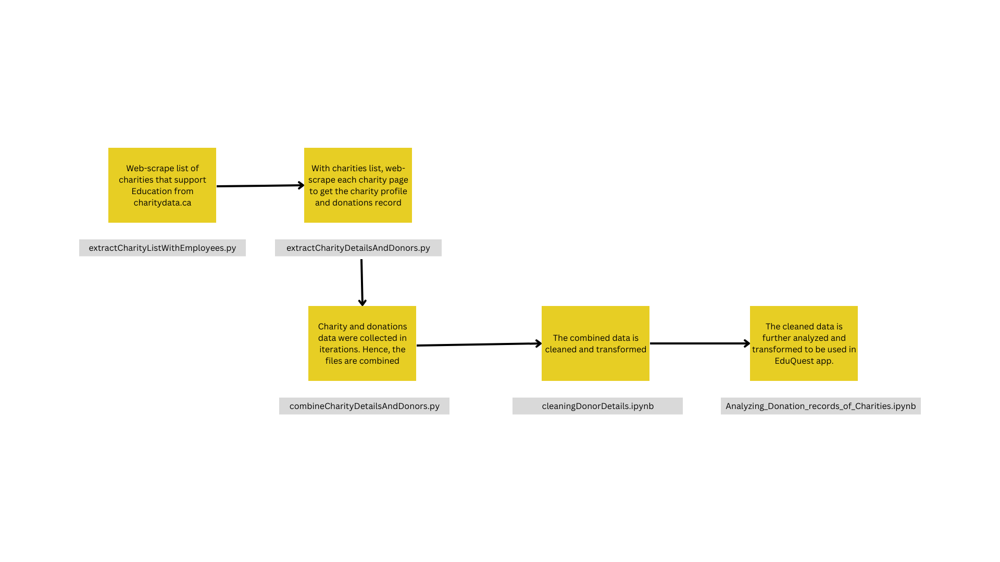

# data-pipeline-to-extract-donation-records
A data pipeline that can be used to extract donation records from Charity Data (Canada) site through web-scrapping

## Introduction
Charity Data (Canada) site provides information on registered charities as disclosed by those charities in their T3010 annual return. It has records of 83,991 registered charities in Canada. It also has the information about donations made between charities. Analyzing donations data has many benefits. 
For example, a donor recommender can be built for non-profits in Canada to determine the potential donors for their cause. 

## Data Pipeline
Currently, the website has donation data for the years: 2018, 2019, 2020, 2021. The charity details are updated yearly. Hence, a streaming pipeline is not necessary for this usecase. In this project, a batch pipeline is built to fetch the donations and charity data from charitydata.ca by web-scrapping and further processing. 

### Tools used
- Python
- BeautifulSoup: for static data on the website
- Selenium: for dynamically generated data on the website
- Pandas: for data cleaning and transformation

